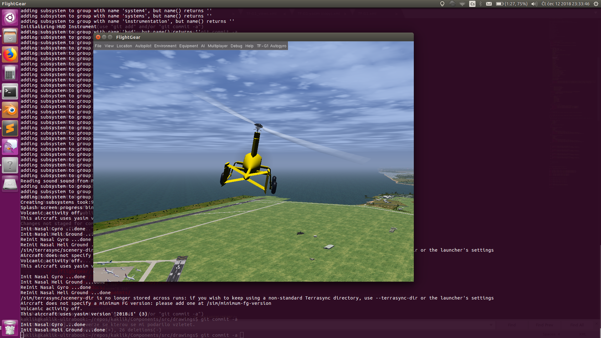

# TF-G1 UAV electric autogyro flightgear simulator model

Model of TF-G1 autogyro for [FlightGear](https://home.flightgear.org/) simulator.  Its purpose is flight training of missions, modifications and measurement compagins.

## Installation

### Linux
The TF-G1 folder contains all model data. Installation of the model itself should be performed by copy of TF-G1 folder into other simullator models. In case of Ubuntu Linux the folder is on the following path: `/usr/share/games/flightgear/Aircraft/`

It is also possible to use simlink from the clonned repository. But Flightgear does not use simlinks in default configuration, therefore the simlinks needs to by allowed by additional parameter `--allow-nasal-read`, as in the case of the following example:

    fgfs --aircraft=TF-G1 --disable-terrasync --disable-random-objects --disable-real-weather-fetch --allow-nasal-read=/usr/share/games/flightgear/Aircraft/TF-G1/Models/Liveries --timeofday=noon

### Windows

In case of Microsoft Windows OS the model should be copied in corresponding folder containing other aircrafts models.  

## Basic controls

The Help could be opened direcly from runnig FlightGear simulator by choose of Help from menubar. Piloting the autogyro without joystick is very difficult and it is not recommended to try. Some functions could be contrelled by keyboard: 

  * key "v" switch views
  * key "s" prerotates the rotor
  * key "B" upper-case B (including shift key), control parking brakes
  * Page-Up and Page-Down controls engine throttle
  * Tabulator key switch between mouse modes
  * Ctrl+w 	Place winch in front of aircraft, hook in and start winch launch
  * "W"   Increase winch speed
  * "w" 	Decrease winch speed
  * Ctrl+"o" 	Find aircraft for aerotow and hook in
  * "o" Open both hooks (pulls the yellow lever) 

Every other inputs needs to be controlled proportionally, in some cases the computer mouse could be used.  By better way is use of [RC controller in joystick mode](https://opentx.gitbooks.io/manual-for-opentx-2-2/radio_joystick.html).

## Model limits

The current model implementation neglects some properties:

  * Real TF-G1 autogyro rotor has 1/3 of mass in load, which is mounted in 3/4 blade lenght. The current model implementation expect equally distributed mass along blade lenght. In the result the rotor energy of simulated rotor is underestimated to real rotor energy.
  * Model využívá na místo elektromotoru spalovací motor, který nemá tak vysokou dynamiku jako elektrický.
  * Tah vrtule je zatím přesně v ose motoru. Reálný kus má vrtuli skloněnou asi 10stupňů dolů
  * Ocas je podepřen uprostřed jedním virtuálním podvozkovým kolečkem pro usnadnění startu a přistání.  Vhodnější by zřejmě bylo model upravit pro dvě kolečka pod každou polovinou ocasní plochy. 

## TODO

  * Publish model in [FlightGear models list](http://wiki.flightgear.org/Table_of_models)
  * Include real textures

